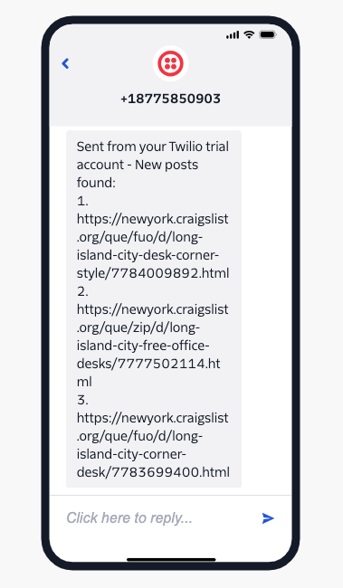

# Craigslist Free Section Scraper

<p align="center">
    
</p>

## Overview
Items on the free section side of Craigslist get sold quickly, especially for in demand items such as furniture. This web scrapper tracks the posts on a Craigslist URL and sends a notification for any new posts that arise. This is helpful from deterring the need to monitor and refresh the page throughout the day.

## Installation
In a [**Python>=3.8**](https://www.python.org/) environment, install the packages in the requirements.txt file:

```
pip install -r requirements.txt
```

## Requirements
Python requirements include:

`bs4`

`loguru`

`pandas`

`python-dotenv`

`requests`

`twilio`

## Usage
This script uses environment variables to store sensitive information so a `.env` file should be created in the root diretory with the below variables. Use the provided .env.example file and rename it to .env while filling in the appropriate values for your environment

| Variable    | Description                     |
|-------------|---------------------------------|
| BASE_URL    | Craigslist free section URL     |
| ACCOUNT_SID | Twilio account SID              |
| AUTH_TOKEN  | Twilio Auth token               |
| FROM_PHONE  | Twilio phone number             |
| TO_PHONE    | Phone number to send message to |

After the environment variables have been set, you can run the script in the source directory

`python CraigsListScraper.py`

- [posts.txt](src/posts.txt) is used to store posts that have already been seen so they aren't revisited
- [results.csv](src/results.csv) will be populated with the new posts discovered during a run
- Use `*/2 * * * *` as the schedule expression to run the script as a [Cron](https://crontab.guru/every-2-minutes) job every 2 minutes and it'll notify you of any new free posts that pop up
- **NOTE**: Running the job at an interval of less than 2 minutes might get you IP banned from Craigslist

<p align="center">
    <br/>
    
</p>